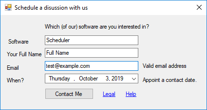

# scheduler.solution
C# based appointment booking client software

## Installation
* In [Configurations](ContactsCollector/Configurations.cs), Edit your API Gateway, and endpoint URLs.
* Create an endpoint/API Server to save of the POSTed request.
